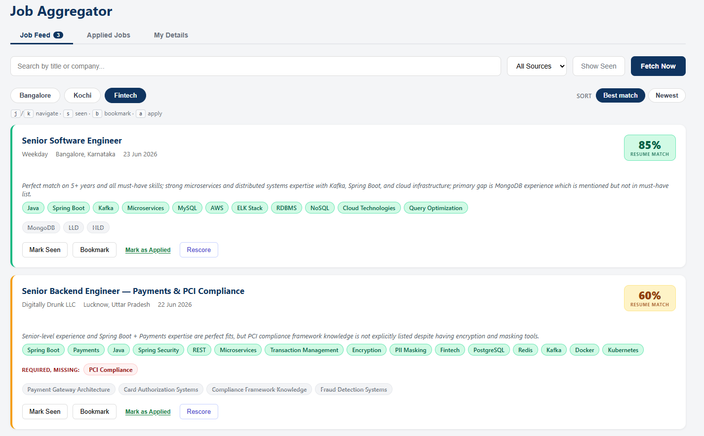
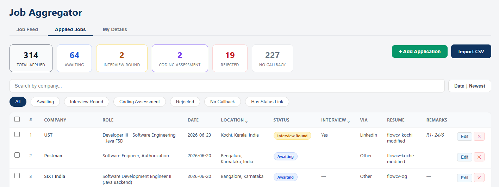

# Job Aggregator

A personal, single-user job-hunting dashboard. Aggregates Java/backend listings from multiple sources, parses your resume with Claude AI, scores every job against your profile, and lets you track applications — all in one place.

---

## Table of Contents

- [Demo](#demo)
- [Why This Exists](#why-this-exists)
- [Setup](#setup)
- [How the AI Matching Works](#how-the-ai-matching-works)
- [Features](#features)
- [Tech Stack](#tech-stack)
- [Project Structure](#project-structure)
- [Configuration Reference](#configuration-reference)
- [API Reference](#api-reference)
- [Job Sources](#job-sources)
- [Database Schema](#database-schema)
- [Future Ideas](#future-ideas)

---

## Demo



*Job feed showing AI-generated match scores, skill overlap chips, and missing skills per listing.*



*Application tracker with status filters, inline editing, and bulk actions.*

---

## Why This Exists

Checking LinkedIn, Adzuna, and other portals every day is tedious — and even when you find a relevant role, deciding whether it's worth applying takes more reading. This tool pulls jobs into one feed, follows each listing's detail page to grab the full job description, and uses Claude AI to score every job against your uploaded resume. You see a `% match`, the skills you already have vs. the ones missing, and an experience-fit signal — so you spend time only on roles that are actually worth applying to.

---

## Setup

### Prerequisites
- Java 17+
- Maven
- Node.js 18+
- PostgreSQL running locally
- An **Anthropic API key** (for Claude resume parsing and job scoring)
- Free **Adzuna API credentials** — sign up at [developer.adzuna.com](https://developer.adzuna.com)

### 1. Create the database
```sql
CREATE DATABASE jobdb;
```

### 2. Configure the app
```bash
cp backend/src/main/resources/application.yml.example \
   backend/src/main/resources/application.yml
```
Then open `application.yml` and fill in:
- `spring.datasource.password` — your PostgreSQL password
- `adzuna.app-id` and `adzuna.app-key` — from the Adzuna developer portal
- `ANTHROPIC_API_KEY` — set as an environment variable, or paste the key directly into `anthropic.api-key`
- `linkedin.keywords`, `linkedin.location`, `adzuna.query`, `adzuna.location` — customise to your target role and city

### 3. Start the backend
```bash
cd backend
mvn spring-boot:run
```
Runs on `http://localhost:8080`. Hibernate auto-creates and migrates the schema on startup via `ddl-auto: update`.

### 4. Start the frontend
```bash
cd frontend
npm install
npm run dev
```
Runs on `http://localhost:5173`.

### 5. Upload your resume and fetch jobs
1. Open **http://localhost:5173** → **My Details** → click **Upload Resume** (PDF or DOCX). Wait ~10–20s for Claude Sonnet to parse it.
2. Click **Fetch Now** in the Job Feed. New jobs are scored against your resume automatically and sorted by match score.

---

## How the AI Matching Works

```
Upload resume (PDF/DOCX)
        ↓
Apache Tika extracts text
        ↓
Claude Sonnet parses it → skills, stack, years of experience, seniority, summary
        ↓
New job ingested (from LinkedIn / Adzuna / Remotive / Greenhouse)
        ↓
Claude Haiku scores each job (batched 5 at a time):
  · skill overlap score  (0–100)
  · years required (min/max)
  · matched skills / missing skills
  · one-line rationale
        ↓
Backend applies deterministic experience gating (in Java, not in the LLM):
  · gap = 0  →  final score = skill score          (green if ≥ 61)
  · gap = 1  →  capped at 60  "Stretch +1y"        (yellow)
  · gap ≥ 2  →  capped at 25  "Needs Xy · You: Zy" (red)
```

The gating is intentionally done in code so the LLM can't talk its way past a hard experience mismatch.

---

## Features

### Job Feed
- Aggregates jobs from **LinkedIn**, **Adzuna**, **Remotive**, and **Greenhouse** — scheduled every 4 hours
- Location and domain tabs configurable via `application.yml`
- Full job descriptions pulled per listing: LinkedIn via `/jobPosting/{id}`, Adzuna via the embedded `window["az_details"]` JS object on the detail page
- **Match score** badge per card (e.g. `85% match`), colour-graded: green ≥ 61, yellow 26–60, red ≤ 25
- **Experience-fit pill** — `Stretch +1y`, `Needs 7+y · You: 5y`, `Overqualified`, or `Exp. not stated`
- **Matched skills** (green) and **missing skills** (struck-through) shown per card
- **Mark Seen** / **Bookmark** / **Mark as Applied** (pre-fills the application form) / **Rescore** (per-job on demand)
- Sorted by match score desc, then posted date

### Resume / My Details
- Upload **PDF or DOCX** — Apache Tika extracts text, Claude Sonnet parses it into structured fields
- Skill chips, years of experience, seniority, stack, and summary visible on the **My Details** tab
- **Editable** — fix anything Claude got wrong; saving re-scores all unreviewed jobs asynchronously
- Personal-details section (name, email, phone, links) with copy-to-clipboard for filling forms quickly

### Application Tracker
- Track applications with statuses: `Awaiting`, `Interview Round`, `Coding Assessment`, `Rejected`, `No Callback`
- Add manually or **import CSV** (additive; duplicates skipped by company + role + date)
- **Bulk action** — select multiple rows and mark them all as No Callback in one click
- Inline edit per row: status, date, interview type, remarks, resume version used, and a status check URL (linked from the company name)
- Filter pills, column filters (location, interview round), search by company, sort by date
- Stat cards per status and pagination at 20/page

---

## Tech Stack

| Layer | Technology |
|---|---|
| Backend | Java 17, Spring Boot 3.x |
| ORM | Spring Data JPA + Hibernate |
| Database | PostgreSQL |
| Scheduler | Spring `@Scheduled` (every 4 hours) |
| Scraping | Jsoup (LinkedIn + Adzuna detail pages) |
| Job APIs | Adzuna REST API, Remotive REST API, Greenhouse Boards API |
| Resume parsing | Apache Tika 2.x (PDF + DOCX extraction) |
| LLM — resume parsing | Claude Sonnet (via Anthropic Java SDK) |
| LLM — job scoring | Claude Haiku (batched, via Anthropic Java SDK) |
| CSV parsing | OpenCSV |
| Build | Maven |
| Frontend | React 18 + Vite |
| HTTP client | Axios |
| Styling | Plain CSS |

---

## Project Structure

```
job-aggregator/
├── backend/
│   ├── pom.xml
│   └── src/main/
│       ├── java/com/archana/jobs/
│       │   ├── JobAggregatorApplication.java
│       │   ├── config/
│       │   │   ├── AnthropicConfig.java        # Anthropic SDK client bean
│       │   │   └── WebConfig.java              # CORS (reads cors.allowed-origins from config)
│       │   ├── controller/
│       │   │   ├── JobController.java
│       │   │   ├── ApplicationController.java
│       │   │   └── ProfileController.java
│       │   ├── model/
│       │   │   ├── Job.java
│       │   │   ├── Application.java
│       │   │   └── Profile.java
│       │   ├── repository/
│       │   │   ├── JobRepository.java          # filters + match-score candidate query
│       │   │   ├── ApplicationRepository.java
│       │   │   └── ProfileRepository.java
│       │   ├── service/
│       │   │   ├── JobIngestionService.java    # orchestrates sources → dedup → enrich → score
│       │   │   ├── LinkedInService.java        # scrape + parallel per-job enrichment
│       │   │   ├── AdzunaService.java          # API + throttled detail-page enrichment
│       │   │   ├── RemotiveService.java        # API, India-accessibility filter
│       │   │   ├── GreenhouseService.java      # Greenhouse Boards API, curated company list
│       │   │   ├── ResumeAnalysisService.java  # Tika → Claude Sonnet → profile fields
│       │   │   └── JobMatchingService.java     # Claude Haiku batched scoring + experience gating
│       │   ├── scheduler/
│       │   │   └── IngestionScheduler.java     # @Scheduled(fixedRate = 4h)
│       │   └── util/
│       │       ├── SkillExtractor.java         # regex match against ~100 known tech skills
│       │       └── DomainClassifier.java       # domain classification from company + JD text
│       └── resources/
│           ├── application.yml                 # your local config (gitignored)
│           └── application.yml.example         # template — copy this to application.yml
└── frontend/
    ├── vite.config.js                          # proxies /api → localhost:8080
    └── src/
        ├── App.jsx
        ├── api/
        │   ├── jobs.js
        │   ├── applications.js
        │   └── profile.js
        ├── context/
        │   └── ProfileContext.jsx
        └── components/
            ├── FilterBar.jsx
            ├── JobCard.jsx
            ├── ApplicationsTab.jsx
            ├── AddApplicationModal.jsx
            ├── ColumnFilter.jsx
            └── MyDetailsTab.jsx
```

---

## Configuration Reference

Key properties in `application.yml` (see `application.yml.example` for the full template):

| Property | Default | Description |
|---|---|---|
| `linkedin.keywords` | `Java+Spring+Boot+Fintech` | URL-encoded LinkedIn search keywords |
| `linkedin.location` | `Bangalore` | Primary LinkedIn location |
| `linkedin.location-secondary` | _(blank)_ | Second LinkedIn location; leave blank to disable |
| `adzuna.query` | `java spring boot` | Primary Adzuna search query |
| `adzuna.query-fintech` | _(falls back to query)_ | Alternate fintech-focused Adzuna query |
| `adzuna.location` | `bangalore` | Primary Adzuna location filter |
| `adzuna.location-secondary` | _(blank)_ | Second Adzuna location; leave blank to disable |
| `adzuna.max-days-old` | `30` | Ignore Adzuna listings older than this |
| `greenhouse.boards` | _(blank)_ | Comma-separated Greenhouse board slugs to monitor |
| `remotive.search` | `java backend` | Remotive keyword search |
| `cors.allowed-origins` | `http://localhost:5173` | Comma-separated allowed CORS origins |

---

## API Reference

### Jobs
| Method | Endpoint | Description |
|---|---|---|
| `GET` | `/api/jobs` | Job feed — filters: `keyword`, `source`, `domain`, `hideSeen`, `location` |
| `PATCH` | `/api/jobs/{id}/seen` | Mark job as seen |
| `PATCH` | `/api/jobs/{id}/bookmark` | Toggle bookmark |
| `POST` | `/api/jobs/ingest` | Trigger ingestion (synchronous) |
| `GET` | `/api/jobs/score-all` | Re-score all unreviewed jobs against the current resume |
| `POST` | `/api/jobs/{id}/rescore` | Score a single job on demand |

### Applications
| Method | Endpoint | Description |
|---|---|---|
| `GET` | `/api/applications` | Filters: `status`, `company`, `sort` |
| `POST` | `/api/applications` | Add a single application |
| `PATCH` | `/api/applications/{id}/status` | Update fields: status, company, appliedDate, interview, remarks, resumeLabel, statusCheckUrl |
| `PATCH` | `/api/applications/bulk-status` | Bulk update — body: `{ ids: [1,2,3], status: "No Callback" }` |
| `DELETE` | `/api/applications/{id}` | Delete an application |
| `POST` | `/api/applications/upload` | Import CSV (deduped by company + role + date) |

### Profile
| Method | Endpoint | Description |
|---|---|---|
| `GET` | `/api/profile` | Get the profile |
| `PUT` | `/api/profile` | Save profile (triggers async re-score if resume fields changed) |
| `POST` | `/api/profile/resume` | Upload resume — Tika + Claude Sonnet parse → save + async re-score |

---

## Job Sources

| Source | Method | Notes |
|---|---|---|
| **LinkedIn** | Jsoup scrape of `seeMoreJobPostings` (last 7 days, mid-senior) → parallel per-job enrichment via `/jobPosting/{id}` | No login required. ~25 results per query. Personal/educational use. |
| **Adzuna** | REST API (configurable queries + locations) → throttled detail-page enrichment | 1 req/s to stay polite. Free tier: 250 req/day. |
| **Remotive** | REST API, `java backend` query | Filtered to listings accessible from India. Full descriptions from API — no scraping. |
| **Greenhouse** | Greenhouse Boards API — fetches all roles per configured board | Filtered by title keywords to engineering roles only. India + remote location matching. |

**Enrichment approach:**
- LinkedIn enriches inline in `fetchJobs()` — parallel (8 threads), ~5–10s per ingestion run
- Adzuna enriches *after* dedup — only new jobs get the 1s/job throttle, avoiding wasted time on duplicates
- Remotive and Greenhouse provide full descriptions from their APIs natively

---

## Database Schema

### `jobs`
| Column | Type | Notes |
|---|---|---|
| id | SERIAL PK | |
| title, company, location | VARCHAR(255) | |
| url | TEXT UNIQUE | deduplication key |
| source | VARCHAR(50) | `linkedin`, `adzuna`, `remotive`, `greenhouse` |
| domain | VARCHAR(50) | `fintech` or `other` |
| country | VARCHAR(10) | `IN` |
| description | TEXT | full text after enrichment |
| skills | TEXT | comma-separated, from `SkillExtractor` |
| posted_date, ingested_at | TIMESTAMP | |
| is_seen, is_bookmarked | BOOLEAN | |
| match_score | INT | 0–100, after experience gating |
| match_skill_score | INT | 0–100, raw skill overlap from Claude |
| matched_skills | TEXT | comma-separated |
| missing_skills | TEXT | comma-separated |
| years_required_min/max | INT | parsed from JD; null if not stated |
| experience_fit | VARCHAR(20) | `match` / `underqualified` / `overqualified` / `unknown` |
| experience_gap_years | INT | years short (0 if matched or overqualified) |
| match_rationale | TEXT | one-line explanation from Claude |
| match_computed_at | TIMESTAMP | |

### `applications`
| Column | Type | Notes |
|---|---|---|
| id | SERIAL PK | |
| company, role, location | VARCHAR(255) | |
| applied_date | VARCHAR(100) | `YYYY-MM-DD` |
| status | VARCHAR(50) | Awaiting / Interview Round / Coding Assessment / Rejected / No Callback |
| interview, mode_of_application | VARCHAR(100) | |
| remarks, status_check_url | TEXT | |
| resume_label | VARCHAR(100) | which resume version was sent |
| created_at | TIMESTAMP | |

### `profile` (single row, `id = 1`)
| Column | Type | Notes |
|---|---|---|
| id | BIGINT PK | always `1` |
| name, email, phone | VARCHAR | |
| address, linkedin_url, portfolio_url, resume_url | TEXT | |
| role_description | TEXT | free-form blurb for application "about yourself" boxes |
| resume_filename | VARCHAR(255) | |
| resume_uploaded_at | TIMESTAMP | |
| resume_text | TEXT | raw text from Tika (capped 50,000 chars) |
| resume_skills | TEXT | comma-separated, from Claude |
| resume_stack | VARCHAR(255) | e.g. `Java/Spring Boot fintech backend` |
| resume_years_of_experience | INT | |
| resume_seniority | VARCHAR(50) | Junior / Mid-level / Senior / Lead / Staff / Principal |
| resume_summary | TEXT | 1–2 sentence summary from Claude |
| resume_labels | TEXT | newline-separated resume version labels |

---

## Future Ideas

- Prompt caching on the resume + rubric (system prompt stays warm across batched scoring calls — ~60% input-token savings)
- Daily digest email of top 5 unseen matches
- Browser extension to mark "applied" directly from a LinkedIn or company career page
- Smarter Adzuna throttle — back off on 429 and resume, rather than a fixed 1s sleep
- Pagination of LinkedIn listings (currently `start=0` only, ~25 results per query)
